

<!-- ================= BANNER SUPERIOR ANIMADO ================= -->

<!-- ================= TAGLINE ANIMADA (typing svg) ================= -->

<!-- ================= SOBRE MÍ ================= -->
## 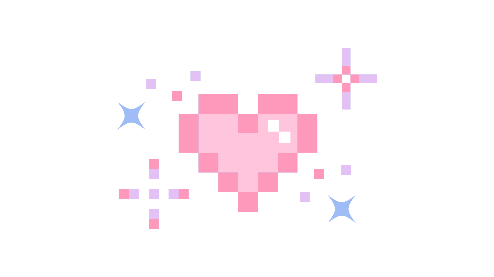 Sobre mí

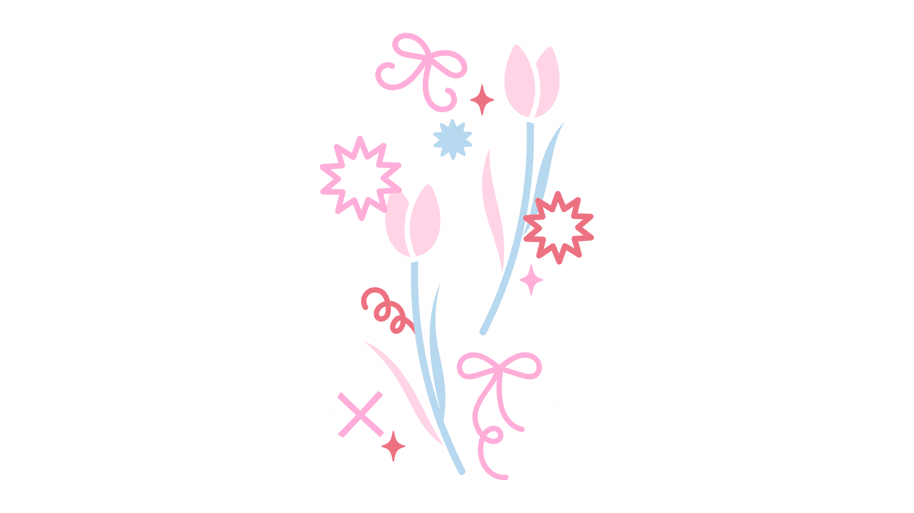

Soy **María Paula Ardila Otero**, estudiante de **Ciencias de la Computación** con doble titulación en **Estadística** en la **Universidad Nacional de Colombia**, sede Medellín.

Me interesa la intersección entre el análisis de datos y el desarrollo de software: me gusta entender los números tanto como construir las herramientas que los procesan.

 

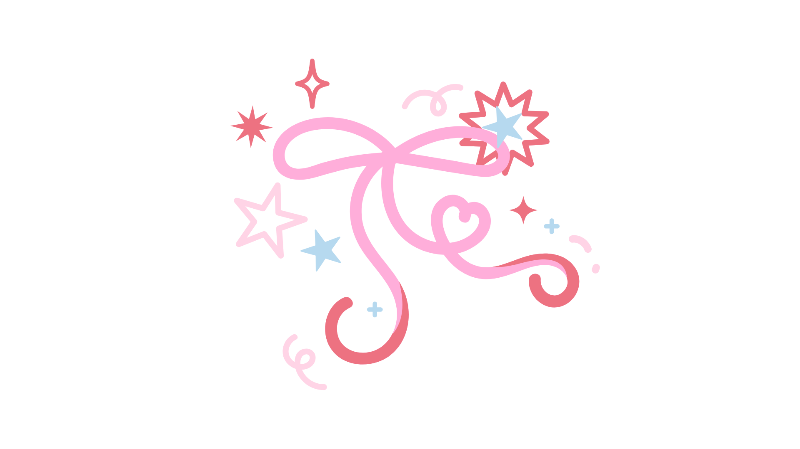

<!-- ================= STACK ================= -->
## 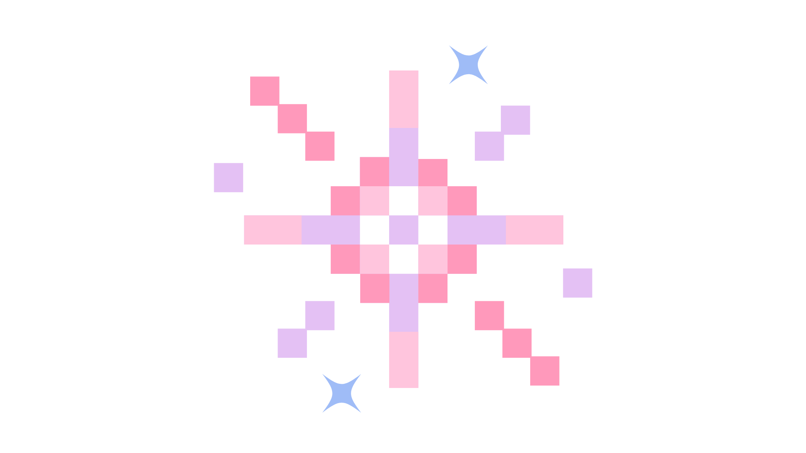 Stack

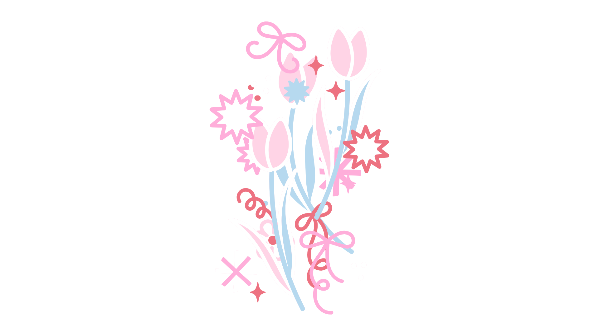

<!-- ================= PROYECTOS ================= -->
## 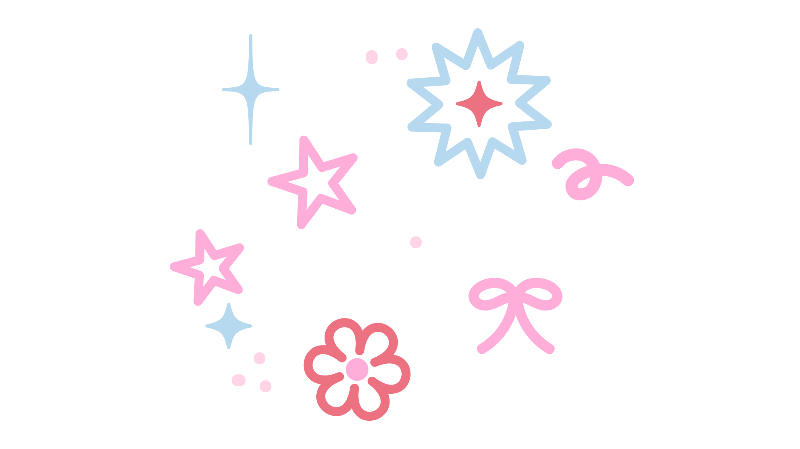 Proyectos

<table align="center">
<tr>
<td width="100%">

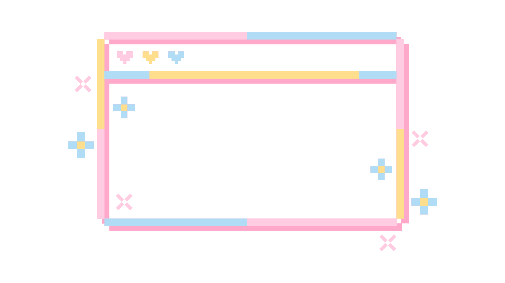

### 📊 Muestreo Estadístico — Riesgo de Deserción Estudiantil

Diseño metodológico y cálculo muestral mediante **Muestreo Aleatorio Estratificado (MAE)** para el estudio de la vulnerabilidad económica y el riesgo de deserción estudiantil.

</td>
</tr>
</table>

<i>✦ más proyectos próximamente ✦</i>

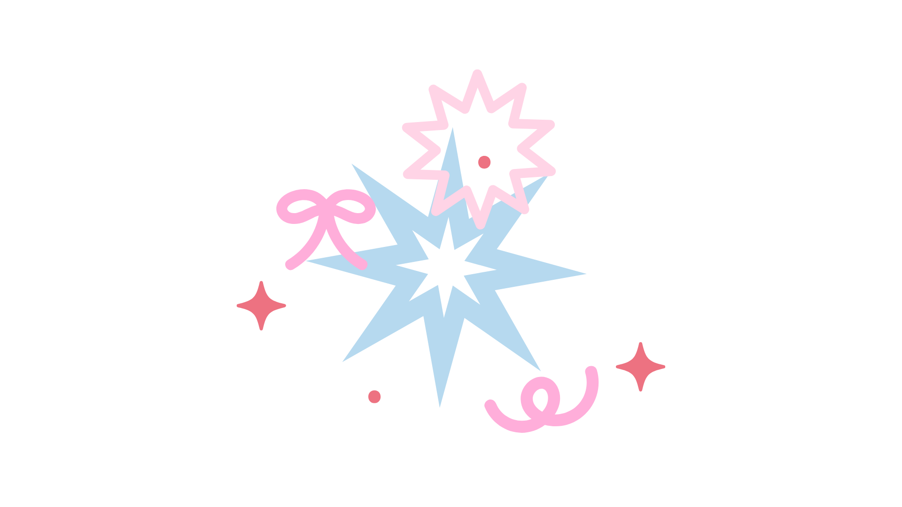

<!-- ================= ESTADÍSTICAS + SNAKE ================= -->
## 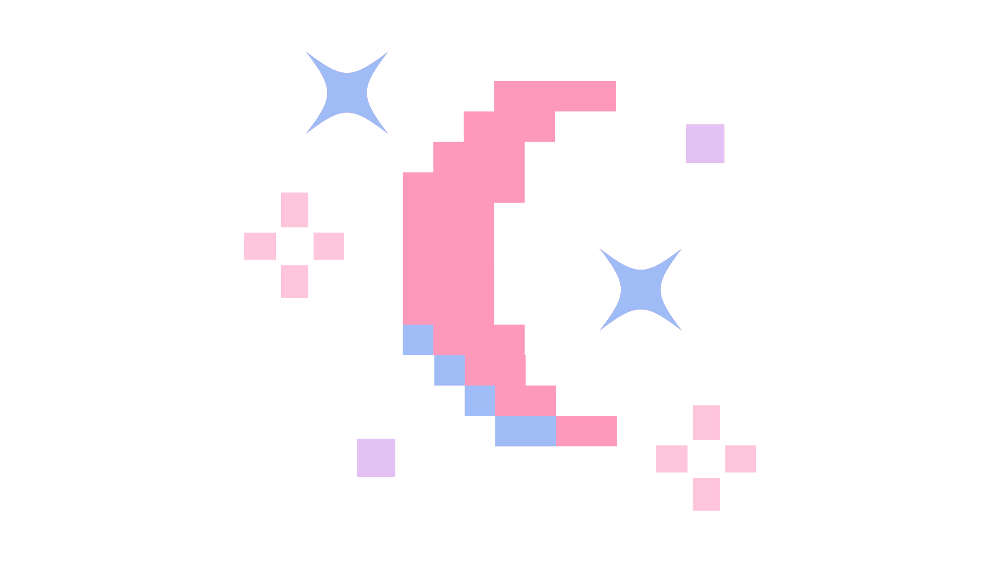 Estadísticas

  

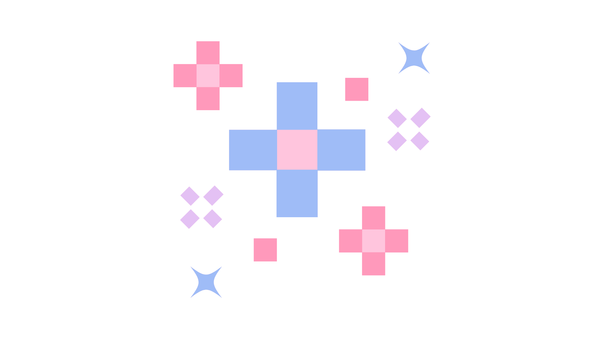

<!-- ================= CONTACTO ================= -->
## 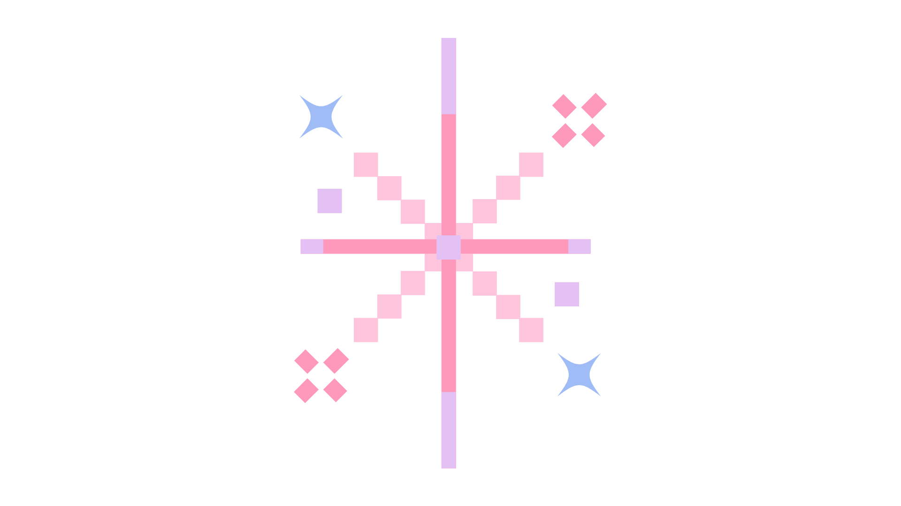 Contacto

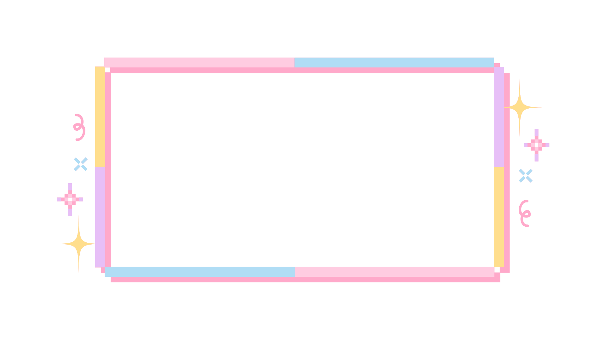
 

<!-- ================= BANNER INFERIOR ================= -->

