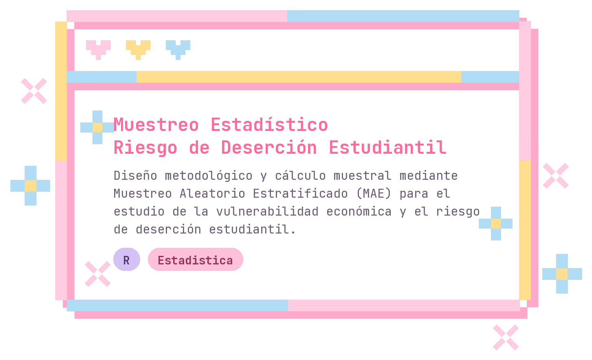
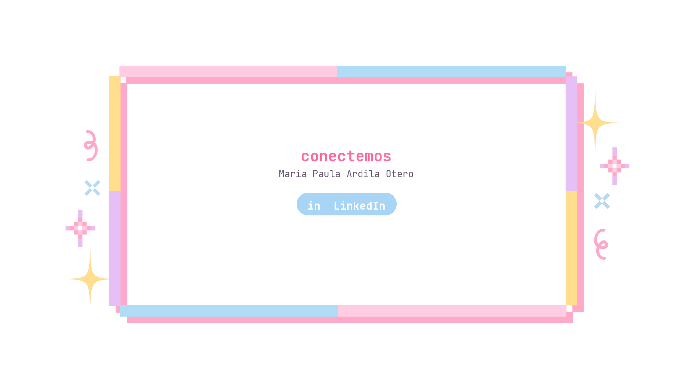

<!-- ================= BANNER SUPERIOR: círculos difuminados con nombre ================= -->

<!-- ================= TAGLINE ANIMADA ================= -->

 

<!-- ================= SOBRE MÍ + STACK EN DOS COLUMNAS ================= -->
<table width="100%">
<tr>
<td width="55%" valign="top">

### ⋆ Sobre mí

<samp>

Soy **María Paula Ardila Otero**, estudiante de **Ciencias de la Computación** con doble titulación en **Estadística** en la **Universidad Nacional de Colombia**, sede Medellín.

Me interesa la intersección entre el análisis de datos y el desarrollo de software: me gusta entender los números tanto como construir las herramientas que los procesan.

</samp>

</td>
<td width="45%" valign="top" align="center">

### ⋆ Stack

 

</td>
</tr>
</table>

 

<!-- ================= PROYECTOS ================= -->
## ⋆ Proyectos

<samp><i>✦ más proyectos próximamente ✦</i></samp>

 

<!-- ================= ESTADÍSTICAS + SNAKE ================= -->
## ⋆ Estadísticas

  

 

<!-- ================= CONTACTO ================= -->
## ⋆ Contacto

<!-- ================= BANNER INFERIOR: círculos difuminados ================= -->

